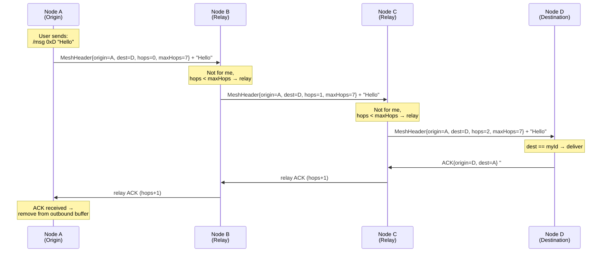
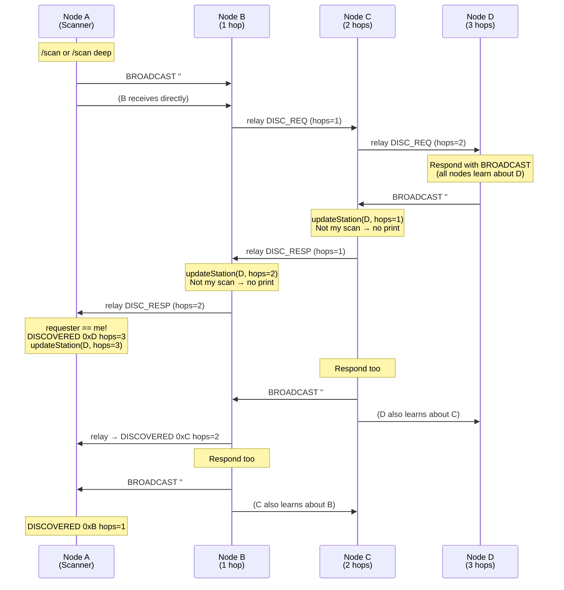
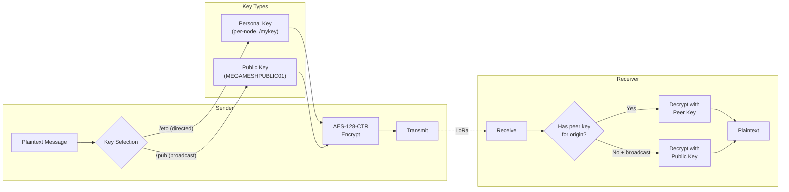
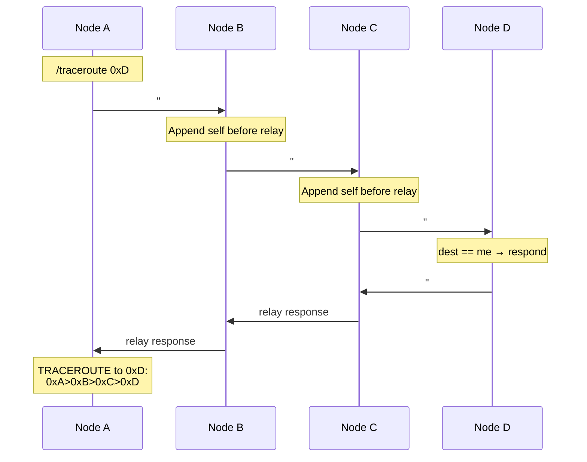
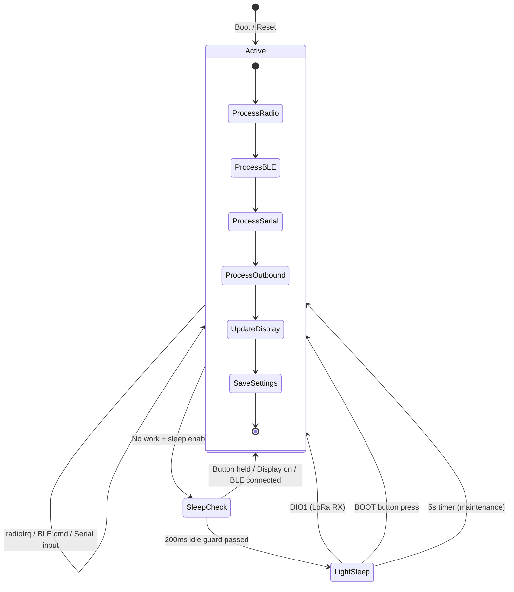
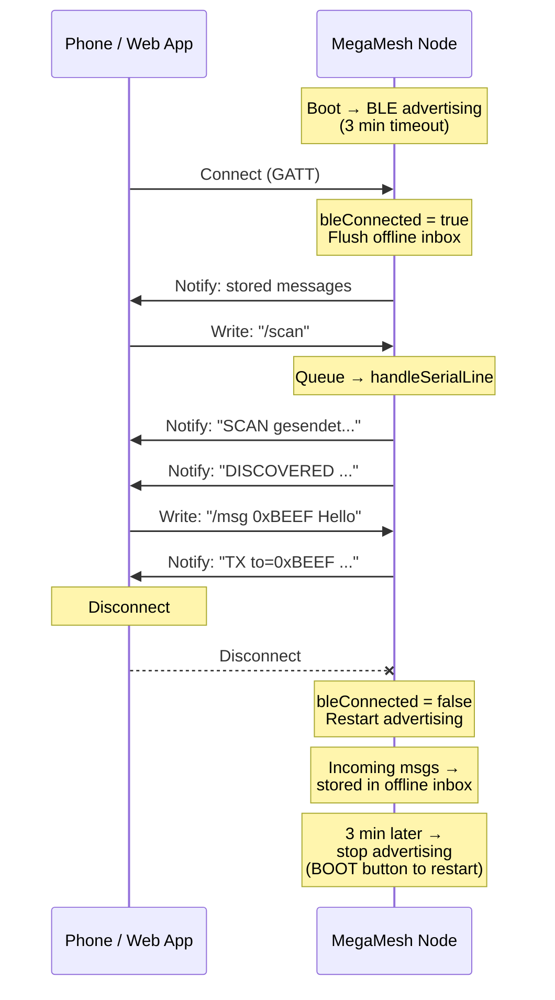
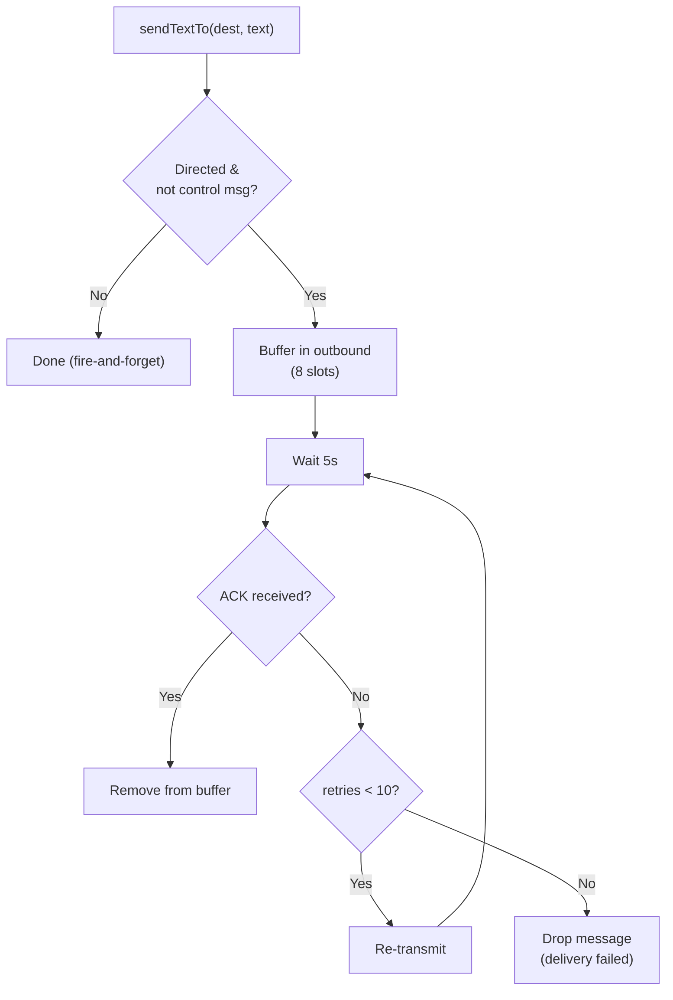

# MegaMesh Protocol – Visual Documentation

## 1. Node Architecture

```mermaid
graph TB
    subgraph "User Interfaces"
        SERIAL["Serial Console<br/>(USB CDC)"]
        BLE_APP["BLE App / Web Client<br/>(Chrome/Edge/Android)"]
    end

    subgraph "ESP32-S3 Node"
        BLE_STACK["BLE UART Service<br/>(NUS 6E400001)"]
        CMD_QUEUE["Command Ring Buffer<br/>(16 slots)"]
        CMD_HANDLER["handleSerialLine()<br/>Command Parser"]
        MESH_LOGIC["Mesh Protocol Engine"]
        ENCRYPT["AES-128-CTR<br/>Encryption"]
        NVS["NVS Flash<br/>Persistent Settings"]
        OLED["OLED Display<br/>SSD1306 128x64"]
        INBOX["Offline Inbox<br/>(10 messages)"]
    end

    subgraph "Radio Hardware"
        SX1262["SX1262 LoRa Radio<br/>869.4 MHz / SF9 / BW125"]
        PA["GC1109 PA<br/>(V4 only, +27 dBm)"]
        ANT["Antenna"]
    end

    SERIAL -->|"USB CDC"| CMD_HANDLER
    BLE_APP <-->|"GATT Notify/Write"| BLE_STACK
    BLE_STACK -->|"RX Char"| CMD_QUEUE
    CMD_QUEUE --> CMD_HANDLER
    BLE_STACK <--|"TX Char (Notify)"| MESH_LOGIC
    CMD_HANDLER --> MESH_LOGIC
    MESH_LOGIC <--> ENCRYPT
    MESH_LOGIC <--> NVS
    MESH_LOGIC --> OLED
    MESH_LOGIC <--> INBOX
    MESH_LOGIC <--> SX1262
    SX1262 <--> PA
    PA <--> ANT
```

---

## 2. Packet Structure

```
┌──────────────────────────── MeshHeader (13 bytes, packed) ──────────────────────────┐
│ magic   │ ver │ origin  │ msgId   │ dest    │ hops │ maxHops │ flags │ payloadLen │
│ 2 bytes │ 1 B │ 2 bytes │ 2 bytes │ 2 bytes │ 1 B  │ 1 B     │ 1 B   │ 1 B        │
│ 0x4D48  │  1  │ nodeId  │ seq++   │ target  │  0…n │  1…15   │ enc?  │ 0…180      │
└──────────┴─────┴─────────┴─────────┴─────────┴──────┴─────────┴───────┴────────────┘
                                                                          │
                                                         ┌───────────────┘
                                                         ▼
                                                 ┌──────────────┐
                                                 │   Payload    │
                                                 │  0–180 bytes │
                                                 │  (plaintext  │
                                                 │  or AES-CTR) │
                                                 └──────────────┘
```

**Flags:**

- `0x01` = `MESH_FLAG_ENCRYPTED` → payload is AES-128-CTR encrypted

**Special destinations:**

- `0xFFFF` = broadcast (all nodes)
- Any other value = directed to specific node

---

## 3. Multi-Hop Mesh Routing



---

## 4. Discovery Protocol (Optimized)



**Key optimization:** Responses are broadcast, so _every_ node on the path passively builds its station table — not just the scanner.

---

## 5. Encryption Flow



**IV construction** (unique per message, no nonce reuse):

```
IV[0..1]  = origin node ID
IV[2..3]  = destination node ID
IV[4..5]  = message ID (incrementing)
IV[6..15] = 0x00
```

---

## 6. Trace Route



---

## 7. Sleep & Wakeup State Machine



---

## 8. BLE Connection Lifecycle



---

## 9. Reliable Delivery (ACK + Retry)



---

## 10. Control Message Reference

| Message            | Direction | Format                                       | Purpose                              |
| ------------------ | --------- | -------------------------------------------- | ------------------------------------ |
| `#MESH_DISC_REQ`   | Broadcast | `#MESH_DISC_REQ`                             | Station discovery scan               |
| `#MESH_DISC_RESP`  | Broadcast | `#MESH_DISC_RESP:0xNODE:0xREQUESTER`         | Discovery response (all nodes learn) |
| `#MESH_ACK`        | Directed  | `#MESH_ACK:originHex:msgId`                  | Delivery acknowledgement             |
| `#MESH_TRACE_REQ`  | Directed  | `#MESH_TRACE_REQ:0xOrigin[>0xRelay...]`      | Trace route request (path appended)  |
| `#MESH_TRACE_RESP` | Directed  | `#MESH_TRACE_RESP:0xA>0xB>...>0xDest`        | Trace route result                   |
| `#MESH_WX_REQ`     | Any       | `#MESH_WX_REQ`                               | Weather data request                 |
| `#MESH_WX_DATA`    | Directed  | `#MESH_WX_DATA:node=0x...,tempC=...,hum=...` | Weather data response                |

---

## 11. V3 vs V4 Hardware Differences

| Feature              | Heltec V3      | Heltec V4          |
| -------------------- | -------------- | ------------------ |
| MCU                  | ESP32-S3       | ESP32-S3           |
| LoRa Chip            | SX1262         | SX1262             |
| PA (Power Amplifier) | None           | GC1109 (+27 dBm)   |
| Max TX Power         | +22 dBm        | +27.7 dBm (via PA) |
| USB                  | Native CDC     | Native CDC         |
| UART Bridge          | yes            | No                 |
| NVS Persistence      | No (RAM only)  | Yes (flash-backed) |
| OLED                 | SSD1306 128x64 | SSD1306 128x64     |
| Battery ADC          | GPIO1 + div    | GPIO1 + div        |
| BOOT Button          | GPIO0          | GPIO0              |
